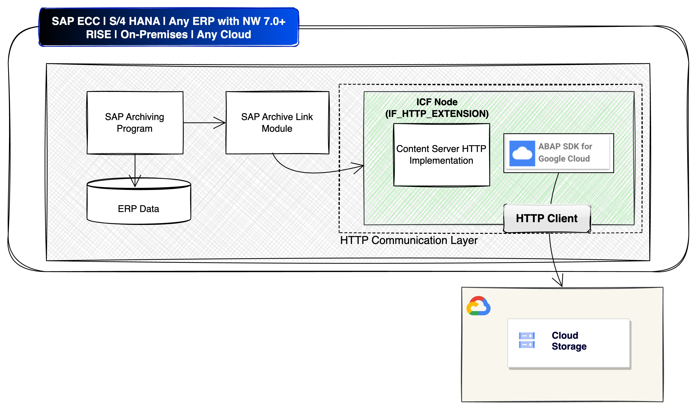
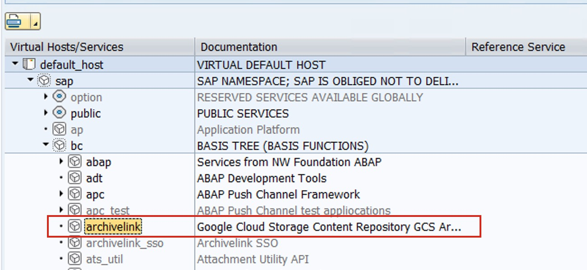
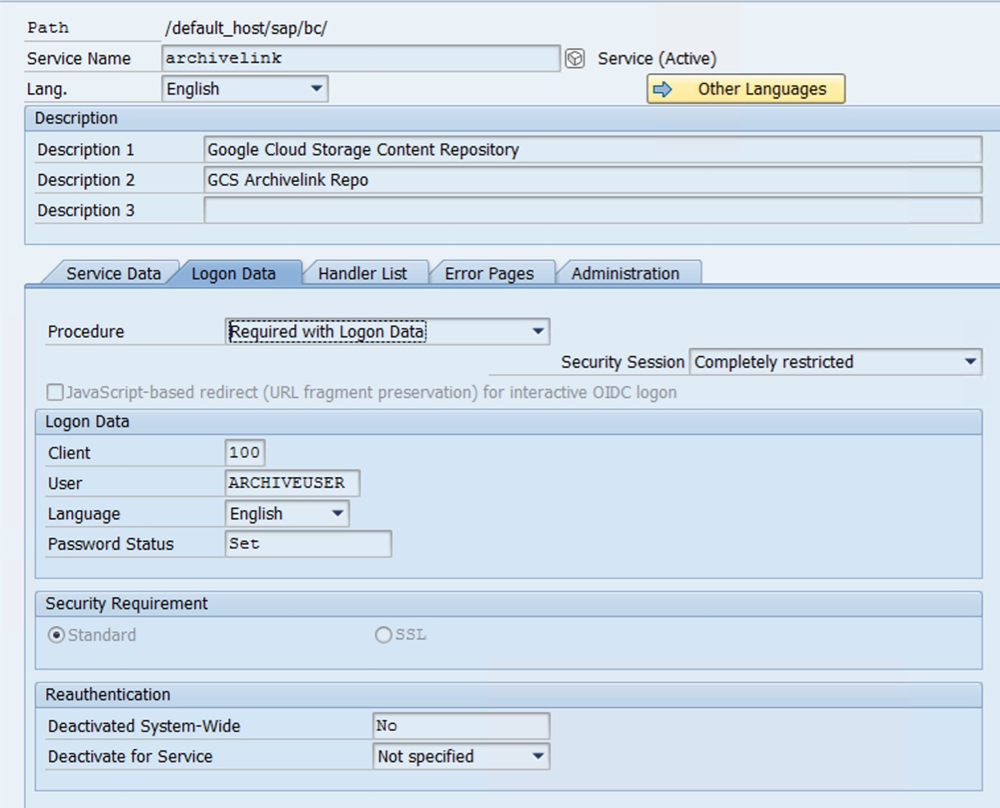
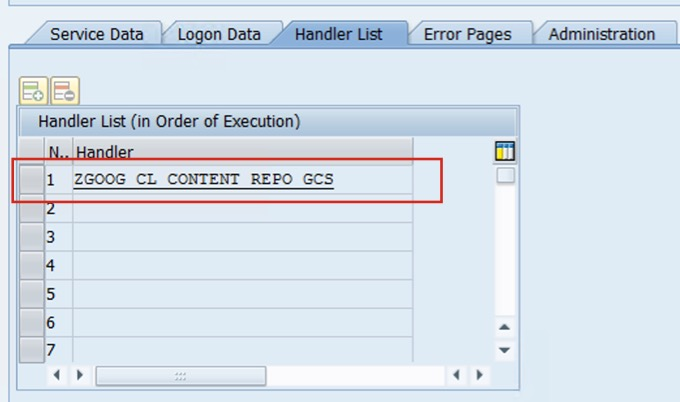
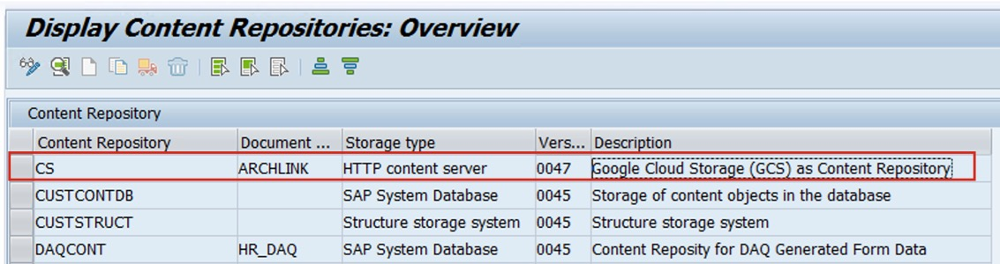
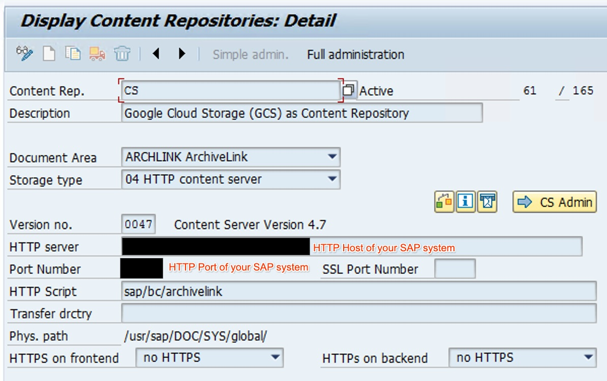
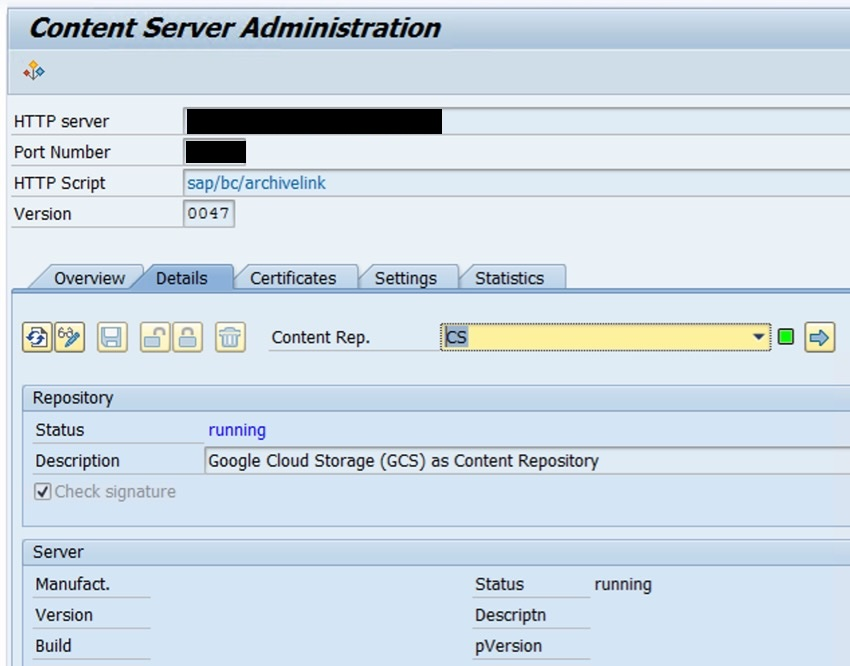
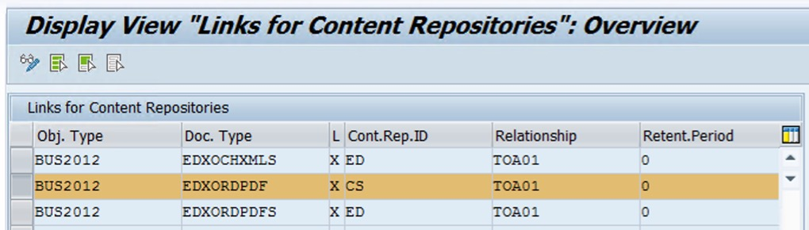
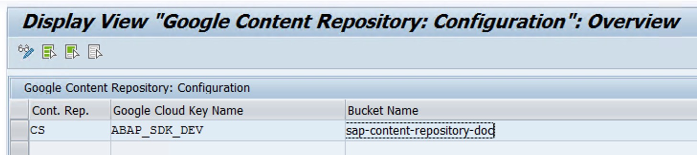

# Google Cloud Storage: Content Server for SAP
## Updates
#### Latest
> 📢 🚀 Latest [release](https://github.com/GoogleCloudPlatform/abap-sdk-sample-archivelink-content-repository/releases) provides a Cloud Run Job that Agentifies attachments stored in the Content Repository by synchronizing Repository data to [Vertex AI Data Store](https://cloud.google.com/generative-ai-app-builder/docs/create-datastore-ingest). With a single click you can link the Data store with [Google Cloud Agentspace](https://cloud.google.com/agentspace/agentspace-enterprise/docs/introduction-to-connectors-and-data-stores) for a seamless search experience of your enterprise data

#### Previous
> 📢 🚀[Annoucing the GA version of the Content Server Solution - Released as part of ABAP SDK V1.10](https://cloud.google.com/solutions/sap/docs/abap-sdk/on-premises-or-any-cloud/latest/implement-gcs-sap-content-repository), which replaces this sample solution\
> IMPORTANT: If you are already using the solution from this repo then refer to the migration guide 📖 to learn more: [Migrate from Open Source to GA version available with ABAP SDK V1.10](https://github.com/GoogleCloudPlatform/abap-sdk-sample-archivelink-content-repository/blob/main/Migration%20Guide%20for%20Content%20Repository%20from%20Open%20Source%20to%20GA%20Version.pdf)
>
> This repo remains as a reference if you are an existing user or want to experiment by adding your own customizations. The standalone [Archive to BigQuery](#archive-to-bigquery) feature is also only avaialable in this repo.
> 
> 📢 🚀[Annoucing Archive to BigQuery feature, powered by BigQuery Toolkit for SAP](#archive-to-bigquery) 
***
> [!IMPORTANT]
> With the release of the **ABAP SDK for Google Cloud V1.10** the solution contained in this repository is no more required to implement Google Cloud Storage as Content Server . 
> Google Cloud Storage as Content Server can be directly implemented using the Handler Class for the SICF node shipped implicitly with the [ABAP SDK for Google Cloud V1.10](https://cloud.google.com/solutions/sap/docs/abap-sdk/on-premises-or-any-cloud/latest/implement-gcs-sap-content-repository)\
> Most importantly, if you are using the solution from this repository you can consider moving to the GA solution available in the ABAP SDK. Please refer to the migration guide for for more info: [Migration Guide](https://github.com/GoogleCloudPlatform/abap-sdk-sample-archivelink-content-repository/blob/main/Migration%20Guide%20for%20Content%20Repository%20from%20Open%20Source%20to%20GA%20Version.pdf)
> 
> This repository will still be kept alive for documentation purposes.

***

This solution utilizes Google Cloud Storage as a content repository to store SAP attachments and archive the data

## Pre-requisites

This solution is built on top of [ABAP SDK for Google Cloud](https://cloud.google.com/solutions/sap/docs/abap-sdk/on-premises-or-any-cloud/whats-new). Therefore your SAP system should have the latest version of the SDK (Version 1.7 or later) installed to proceed ahead. All the required configuration for the SDK to connect to Google Cloud APIs should be set-up following the SDK’s [authentication guide](https://cloud.google.com/solutions/sap/docs/abap-sdk/on-premises-or-any-cloud/latest/authentication).

On your Google Cloud project enable the Google Cloud storage API and set up a bucket with nearline storage.

**Note** : The Service Account that you have configured in the Client Key configuration should have the IAM roles Storage Object Creator `roles/storage.objectCreator` and Storage Admin `roles/storage.admin`

## Steps to setup Archive Link for Cloud Storage

**Step 1:** Follow the [Release Instructions](https://github.com/GoogleCloudPlatform/abap-sdk-sample-archivelink-content-repository/releases) to import the solution into your SAP system.

**Step 2:** Create a background user (user id: ARCHIVEUSER)  to invoke the SICF HTTP Handler class during runtime.

**Step 3:** Create SICF Node for ArchiveLink

**Step 4:** Configure the SICF node

*   Configure the user created in the SICF node along with password
*   Mark procedure as “Required with Logon Data” 

**Step 5:** Configure the HTTP handler Class

Configure the HTTP handler class that is provide with this repository: `ZGOOG_CL_CONTENT_REPO_GCS`

**Step 6:** Setup content server for Cloud Storage

Go to transaction `OAC0` and create an entry for a new content server.

**Step 7:** Link Business Object with Content Repository

1. Go to TCode `OAC3` to setup your business object to be stored in GCS through the Archivelink content repository setup done above, 
2. Here is an example to save Purchase Orders.

**Step 8:** Configure Google Cloud Content Server for SAP

Configure below in table `ZGOOG_CONT_REPO` provided with this repository by going to transaction SM30

1. Content repository created in SAP 
2. ABAP SDK for Google Cloud Client Key.
3. Google Cloud Storage repository name, where you want to store/archive SAP content.

You are now all set to start using Google Cloud Storage as Content Server.!!

## Archive To BigQuery

The new [BigQuery Toolkit for SAP](https://cloud.google.com/solutions/sap/docs/abap-sdk/on-premises-or-any-cloud/latest/bq-toolkit-for-sap-overview) lets you archive SAP table data directly into BigQuery. Query archived data using familiar SE16/N-like functionality within [BigQuery Studio](https://cloud.google.com/bigquery/docs/query-overview#bigquery-studio) and [Looker](https://cloud.google.com/looker), and leverage [BigQuery ML](https://cloud.google.com/bigquery/docs/bqml-introduction) to unlock powerful insights.

### How to configure and Archive to BigQuery

1. Install and configure the latest (V1.9 or above) version of [ABAP SDK for Google Cloud](https://cloud.google.com/solutions/sap/docs/abap-sdk/on-premises-or-any-cloud/latest/install-config)
2. Configure [BigQuery Toolkit for SAP](https://cloud.google.com/solutions/sap/docs/abap-sdk/on-premises-or-any-cloud/latest/bq-toolkit-for-sap-configuration). Make a note of Data Transfer Key configured in Tcode `/GOOG/BQTR_SETTINGS`
3. Configure entries in table `ZGOOG_ARCH_BQ` using SM30
   | Column                                 | Value         |
   | ------------------------------------   | ------------- |
   | Archiving Object                       | Name of the archiving object for which the data should be replicated to BigQuery |
   | Data Transfer Key                      | BigQuery Data Transfer Key from Tcode `/GOOG/BQTR_SETTINGS` |
   | Is Setting Active Flag                 | Enabling this write archive data to BigQuery |
4. When you run the [Archive Delete Program](https://help.sap.com/doc/saphelp_nw73ehp1/7.31.19/en-US/4d/8c788a910b154ee10000000a42189e/frameset.htm), the implementation `ZGOOG_BADI_ARC_WRITE_TO_BQ` of BADI definition `ARC_DEL_FINISHED` will automatically send the archive data to BigQuery. 
5. Alternatively, you can also use program `ZGOOG_R_BQ_WRITE_ARCHIVE_DATA` to manually select and write archive data to BigQuery. 

>[!NOTE]
> BADI `ARC_DEL_FINISHED` is only available in systems with SAP_BASIS component 740 and above. \
> Refer to note [3063034](https://me.sap.com/notes/3063034/E) for more details. \
>If your system is not compatible, you can exclude the implementation `ZGOOG_BADI_ARC_WRITE_TO_BQ` when importing.

## Learn More:

To learn more, you can watch the following YouTube Videos:\

>[!TIP]
>You can also read more on how to archive data to Cloud Storage with Archive Administration Transaction `SARA` in the Medium blog [Archive your SAP Data to Google’s Cloud Storage](https://medium.com/google-cloud/archive-your-sap-data-to-googles-cloud-storage-3b6dfe6f79bd)

Happy Learning!!
